# Developer Onboarding & Architecture Guide

**UsageLogger — "Digital Wellbeing for Windows"**

---

## 1. High-Level Overview

### What It Does
UsageLogger is a Windows desktop application that **tracks which apps you use, for how long, and when** — similar to Android's Digital Wellbeing. It runs silently in the background logging foreground window activity, then presents that data through rich charts and timelines in a modern WinUI 3 dashboard.

### Architectural Pattern: **Two-Process Hybrid**

The application is split into **two independent processes** that communicate via shared memory:


> [!IMPORTANT]
> The Service and UI are **not** coupled. The Service can run without the UI, and the UI reads data independently. They share data through memory-mapped files (real-time) and flat `.log` files on disk (historical).

### Tech Stack

| Layer | Technology | Role |
|---|---|---|
| **UI Framework** | WinUI 3 (Windows App SDK), **Unpackaged** | Modern Windows 11 native look |
| **Runtime** | .NET 8 | All projects target `net8.0-windows10.0.19041.0` |
| **Charts** | Win2D (CanvasControl) | Bar, Pie, Heatmap, Treemap — all custom-drawn |
| **Localization** | WinUI3Localizer | Runtime language switching (11 languages) |
| **System Interop** | P/Invoke (User32, Shell32) | Foreground window detection, icon extraction |
| **IPC** | `MemoryMappedFile` + `Mutex` | Real-time session sharing between processes |
| **Data Storage** | Flat-file `.log` (TSV/JSON lines) | One file per day, human-readable |
| **Audio Tracking** | COM Interop (Core Audio API) | Detects which apps are playing audio |
| **Installer** | WinForms self-extracting EXE | Embeds a ZIP payload at build time |
| **Build** | [publish.ps1](file:///h:/Coding/DigitalWellbeing/DigitalWellbeing_myworkGemini2/publish.ps1) PowerShell script | Single script produces installer + portable ZIP |

---

## 2. Core Components & Directory Structure

### Solution Layout

```
UsageLogger.sln
├── UsageLogger/              ← WinUI 3 UI Client (86 files)
├── UsageLogger.Core/         ← Shared library (17 files)
├── UsageLoggerService/       ← Background service (16 files)
├── UsageLogger.Setup/        ← WinForms installer (3 files)
├── tools/                    ← Localization utilities
├── publish.ps1               ← Build + package script
└── TranslationMap.json       ← Master translation lookup
```

---

### 📦 `UsageLogger.Core` — Shared Foundation

The only project with **zero UI dependencies**. Referenced by both the Service and the UI.

| Path | Purpose |
|---|---|
| [Core.cs](file:///h:/Coding/DigitalWellbeing/DigitalWellbeing_myworkGemini2/UsageLogger.Core/Core.cs) | [ApplicationPath](file:///h:/Coding/DigitalWellbeing/DigitalWellbeing_myworkGemini2/UsageLogger.Core/Core.cs#11-247) — centralized path resolution for logs, icons, cache. All file locations stem from here |
| [ForegroundWindowManager.cs](file:///h:/Coding/DigitalWellbeing/DigitalWellbeing_myworkGemini2/UsageLogger.Core/ForegroundWindowManager.cs) | Win32 P/Invoke wrapper: `GetForegroundWindow` → `WindowFromPoint` → `GetGUIThreadInfo` fallback chain |
| **Models/** | |
| ├ [AppSession.cs](file:///h:/Coding/DigitalWellbeing/DigitalWellbeing_myworkGemini2/UsageLogger.Core/Models/AppSession.cs) | Core data unit: [ProcessName](file:///h:/Coding/DigitalWellbeing/DigitalWellbeing_myworkGemini2/UsageLogger.Core/ForegroundWindowManager.cs#20-31), [ProgramName](file:///h:/Coding/DigitalWellbeing/DigitalWellbeing_myworkGemini2/UsageLogger.Core/ForegroundWindowManager.cs#32-43), [StartTime](file:///h:/Coding/DigitalWellbeing/DigitalWellbeing_myworkGemini2/UsageLogger/ViewModels/AppUsageViewModel.cs#323-333), `EndTime`, [IsAfk](file:///h:/Coding/DigitalWellbeing/DigitalWellbeing_myworkGemini2/UsageLogger/Views/DayAppUsagePage.xaml.cs#741-748), `AudioSources` |
| ├ [AppUsage.cs](file:///h:/Coding/DigitalWellbeing/DigitalWellbeing_myworkGemini2/UsageLogger.Core/Models/AppUsage.cs) | Legacy aggregated usage (process + total seconds) |
| ├ [AppTag.cs](file:///h:/Coding/DigitalWellbeing/DigitalWellbeing_myworkGemini2/UsageLogger.Core/Models/AppTag.cs) | User-defined categories for apps (e.g., "Productive", "Entertainment") |
| └ [CustomTitleRule.cs](file:///h:/Coding/DigitalWellbeing/DigitalWellbeing_myworkGemini2/UsageLogger.Core/Models/CustomTitleRule.cs) | Regex/string rules to transform window titles into friendly names |
| **Data/** | |
| ├ [AppSessionRepository.cs](file:///h:/Coding/DigitalWellbeing/DigitalWellbeing_myworkGemini2/UsageLogger.Core/Data/AppSessionRepository.cs) | Read/write `sessions_*.log` files. Includes legacy `.log` fallback parsing |
| └ [AppUsageRepository.cs](file:///h:/Coding/DigitalWellbeing/DigitalWellbeing_myworkGemini2/UsageLogger.Core/Data/AppUsageRepository.cs) | Read/write aggregated usage data (legacy format) |
| **Helpers/** | |
| ├ [LiveSessionCache.cs](file:///h:/Coding/DigitalWellbeing/DigitalWellbeing_myworkGemini2/UsageLogger.Core/Helpers/LiveSessionCache.cs) | **IPC mechanism**: Memory-mapped file for real-time session sharing + flush signaling |
| ├ [WindowTitleParser.cs](file:///h:/Coding/DigitalWellbeing/DigitalWellbeing_myworkGemini2/UsageLogger.Core/Helpers/WindowTitleParser.cs) | Extracts "sub-app" names from window titles (e.g., "YouTube" from "YouTube - Google Chrome") |
| ├ [StringHelper.cs](file:///h:/Coding/DigitalWellbeing/DigitalWellbeing_myworkGemini2/UsageLogger.Core/Helpers/StringHelper.cs) | String utilities (truncation, sanitization) |
| └ [DictionaryExtensions.cs](file:///h:/Coding/DigitalWellbeing/DigitalWellbeing_myworkGemini2/UsageLogger.Core/Helpers/DictionaryExtensions.cs) | Extension methods for dictionary operations |

---

### ⚙️ `UsageLoggerService` — Background Data Collector

A headless Windows process with a system tray icon. **This is where all data originates.**

| Path | Purpose |
|---|---|
| [Program.cs](file:///h:/Coding/DigitalWellbeing/DigitalWellbeing_myworkGemini2/UsageLoggerService/Program.cs) | **Entry point**. Single-instance mutex → TrayManager init → composition root → [ActivityLogger](file:///h:/Coding/DigitalWellbeing/DigitalWellbeing_myworkGemini2/UsageLoggerService/ActivityLogger.cs#17-264) loop on background thread → `Application.Run()` for message pump |
| [ActivityLogger.cs](file:///h:/Coding/DigitalWellbeing/DigitalWellbeing_myworkGemini2/UsageLoggerService/ActivityLogger.cs) | **Heart of the app**. Called every 1 second: detects foreground window, resolves process/program names, applies incognito mode, reads settings, manages buffer flush timing |
| [SessionManager.cs](file:///h:/Coding/DigitalWellbeing/DigitalWellbeing_myworkGemini2/UsageLoggerService/SessionManager.cs) | Session state machine: creates/extends/finalizes [AppSession](file:///h:/Coding/DigitalWellbeing/DigitalWellbeing_myworkGemini2/UsageLogger.Core/Models/AppSession.cs#10-36) objects. Handles AFK detection (2-min idle), audio change detection, writes to [LiveSessionCache](file:///h:/Coding/DigitalWellbeing/DigitalWellbeing_myworkGemini2/UsageLogger.Core/Helpers/LiveSessionCache.cs#15-214) |
| **Helpers/** | |
| ├ [AudioSessionTracker.cs](file:///h:/Coding/DigitalWellbeing/DigitalWellbeing_myworkGemini2/UsageLoggerService/Helpers/AudioSessionTracker.cs) | COM interop with Windows Core Audio API to detect apps playing audio |
| ├ [AudioUsageTracker.cs](file:///h:/Coding/DigitalWellbeing/DigitalWellbeing_myworkGemini2/UsageLoggerService/Helpers/AudioUsageTracker.cs) | Higher-level audio tracking coordinator |
| ├ [FocusScheduleManager.cs](file:///h:/Coding/DigitalWellbeing/DigitalWellbeing_myworkGemini2/UsageLoggerService/Helpers/FocusScheduleManager.cs) | Loads focus session schedules from disk, enforces focus mode rules |
| ├ [IncognitoMonitor.cs](file:///h:/Coding/DigitalWellbeing/DigitalWellbeing_myworkGemini2/UsageLoggerService/Helpers/IncognitoMonitor.cs) | Monitors incognito mode setting, forces generic process names when enabled |
| ├ [ServiceSettingsReader.cs](file:///h:/Coding/DigitalWellbeing/DigitalWellbeing_myworkGemini2/UsageLoggerService/Helpers/ServiceSettingsReader.cs) | Reads `user_preferences.json` every 30 seconds for hot-reload of settings |
| ├ [ServiceLogger.cs](file:///h:/Coding/DigitalWellbeing/DigitalWellbeing_myworkGemini2/UsageLoggerService/Helpers/ServiceLogger.cs) | File-based debug logging to `service_debug.log` |
| ├ [TrayManager.cs](file:///h:/Coding/DigitalWellbeing/DigitalWellbeing_myworkGemini2/UsageLoggerService/Helpers/TrayManager.cs) | System tray icon with context menu (Open UI, Settings, Exit) |
| ├ [ServiceNotificationHelper.cs](file:///h:/Coding/DigitalWellbeing/DigitalWellbeing_myworkGemini2/UsageLoggerService/Helpers/ServiceNotificationHelper.cs) | Toast notification sender |
| └ [UserInputInfo.cs](file:///h:/Coding/DigitalWellbeing/DigitalWellbeing_myworkGemini2/UsageLoggerService/Helpers/UserInputInfo.cs) | Detects user idle time via `GetLastInputInfo` P/Invoke |

---

### 🖥️ `UsageLogger` — WinUI 3 Dashboard

The full UI client. Uses MVVM-ish pattern (no framework — manual `INotifyPropertyChanged`).

| Path | Purpose |
|---|---|
| [App.xaml.cs](file:///h:/Coding/DigitalWellbeing/DigitalWellbeing_myworkGemini2/UsageLogger/App.xaml.cs) | **UI Entry point**. Single-instance check → load [UserPreferences](file:///h:/Coding/DigitalWellbeing/DigitalWellbeing_myworkGemini2/UsageLogger/Helpers/UserPreferences.cs#53-57) → init `WinUI3Localizer` → create [MainWindow](file:///h:/Coding/DigitalWellbeing/DigitalWellbeing_myworkGemini2/UsageLogger/MainWindow.xaml.cs#22-336) |
| [MainWindow.xaml.cs](file:///h:/Coding/DigitalWellbeing/DigitalWellbeing_myworkGemini2/UsageLogger/MainWindow.xaml.cs) | NavigationView shell: page routing, window management (minimize-to-tray, backdrop), service lifecycle |

#### Views (Pages)

| View | Purpose |
|---|---|
| [DayAppUsagePage](file:///h:/Coding/DigitalWellbeing/DigitalWellbeing_myworkGemini2/UsageLogger/Views/DayAppUsagePage.xaml) | **Main Dashboard** — bar chart (weekly), pie chart, app list with sub-apps, combined/split view toggle |
| [HistoryPage](file:///h:/Coding/DigitalWellbeing/DigitalWellbeing_myworkGemini2/UsageLogger/Views/HistoryPage.xaml) | Date-range analytics: heatmap, treemap, tag-based aggregation |
| [SessionsPage](file:///h:/Coding/DigitalWellbeing/DigitalWellbeing_myworkGemini2/UsageLogger/Views/SessionsPage.xaml) | Detailed timeline view for a specific day showing individual sessions |
| [FocusPage](file:///h:/Coding/DigitalWellbeing/DigitalWellbeing_myworkGemini2/UsageLogger/Views/FocusPage.xaml) | Pomodoro-style focus mode with scheduling |
| [MiscDataPage](file:///h:/Coding/DigitalWellbeing/DigitalWellbeing_myworkGemini2/UsageLogger/Views/MiscDataPage.xaml) | Goal streaks, trend analysis, aggregate statistics |
| [SettingsPage](file:///h:/Coding/DigitalWellbeing/DigitalWellbeing_myworkGemini2/UsageLogger/Views/SettingsPage.xaml) | Comprehensive settings: themes, data paths, tags, exclusions, title rules, language, time limits |

#### ViewModels

| ViewModel | Bound To |
|---|---|
| [AppUsageViewModel](file:///h:/Coding/DigitalWellbeing/DigitalWellbeing_myworkGemini2/UsageLogger/ViewModels/AppUsageViewModel.cs) | [DayAppUsagePage](file:///h:/Coding/DigitalWellbeing/DigitalWellbeing_myworkGemini2/UsageLogger/Views/DayAppUsagePage.xaml.cs#12-834) — loads weekly data, manages charts, auto-refreshes |
| [DayTimelineViewModel](file:///h:/Coding/DigitalWellbeing/DigitalWellbeing_myworkGemini2/UsageLogger/ViewModels/DayTimelineViewModel.cs) | [DayAppUsagePage](file:///h:/Coding/DigitalWellbeing/DigitalWellbeing_myworkGemini2/UsageLogger/Views/DayAppUsagePage.xaml.cs#12-834) (timeline tab) — session blocks for the timeline |
| [HistoryViewModel](file:///h:/Coding/DigitalWellbeing/DigitalWellbeing_myworkGemini2/UsageLogger/ViewModels/HistoryViewModel.cs) | `HistoryPage` — date range data, heatmap, treemap |
| [SessionsViewModel](file:///h:/Coding/DigitalWellbeing/DigitalWellbeing_myworkGemini2/UsageLogger/ViewModels/SessionsViewModel.cs) | `SessionsPage` — individual session list |
| [MiscDataViewModel](file:///h:/Coding/DigitalWellbeing/DigitalWellbeing_myworkGemini2/UsageLogger/ViewModels/MiscDataViewModel.cs) | `MiscDataPage` — trends, streaks |
| [TimeLimitEnforcer](file:///h:/Coding/DigitalWellbeing/DigitalWellbeing_myworkGemini2/UsageLogger/ViewModels/TimeLimitEnforcer.cs) | Cross-cutting — monitors app usage against user-defined time limits |

#### Custom Controls (Win2D)

All charts are **custom-drawn** using Win2D's `CanvasControl`, not LiveCharts2 (despite the system rules mentioning it — the codebase has migrated to Win2D):

| Control | Purpose |
|---|---|
| [Win2DBarChart](file:///h:/Coding/DigitalWellbeing/DigitalWellbeing_myworkGemini2/UsageLogger/Controls/Win2DBarChart.xaml.cs) | Weekly activity bars with click-to-select |
| [Win2DPieChart](file:///h:/Coding/DigitalWellbeing/DigitalWellbeing_myworkGemini2/UsageLogger/Controls/Win2DPieChart.xaml.cs) | Usage distribution with interactive spin/drag |
| [Win2DHeatmap](file:///h:/Coding/DigitalWellbeing/DigitalWellbeing_myworkGemini2/UsageLogger/Controls/Win2DHeatmap.xaml.cs) | Hour-of-day × day-of-week activity heatmap |
| [CustomTreemap](file:///h:/Coding/DigitalWellbeing/DigitalWellbeing_myworkGemini2/UsageLogger/Controls/CustomTreemap.xaml.cs) | Squarified treemap for app usage distribution |

#### Key Helpers

| Helper | Purpose |
|---|---|
| [UserPreferences](file:///h:/Coding/DigitalWellbeing/DigitalWellbeing_myworkGemini2/UsageLogger/Helpers/UserPreferences.cs) | **Central settings** — static class, serialized to `user_preferences.json`. Tags, time limits, display names, excluded processes, custom icons, title rules, and more |
| [IconManager](file:///h:/Coding/DigitalWellbeing/DigitalWellbeing_myworkGemini2/UsageLogger/Helpers/IconManager.cs) | Extracts high-res app icons (256px SHIL_JUMBO) with fallback chain, caches to disk |
| [SessionAggregator](file:///h:/Coding/DigitalWellbeing/DigitalWellbeing_myworkGemini2/UsageLogger/Helpers/SessionAggregator.cs) | Converts raw [AppSession](file:///h:/Coding/DigitalWellbeing/DigitalWellbeing_myworkGemini2/UsageLogger.Core/Models/AppSession.cs#10-36) lists into per-app aggregated data structures |
| [DayChartUpdater](file:///h:/Coding/DigitalWellbeing/DigitalWellbeing_myworkGemini2/UsageLogger/Helpers/DayChartUpdater.cs) | Generates chart data (bar/pie items) from aggregated sessions |
| [FocusManager](file:///h:/Coding/DigitalWellbeing/DigitalWellbeing_myworkGemini2/UsageLogger/Helpers/FocusManager.cs) | UI-side focus mode management, reminders, dialogs |
| [StartupManager](file:///h:/Coding/DigitalWellbeing/DigitalWellbeing_myworkGemini2/UsageLogger/Helpers/StartupManager.cs) | Auto-start registration (Registry + Task Scheduler) |
| [LocalizationHelper](file:///h:/Coding/DigitalWellbeing/DigitalWellbeing_myworkGemini2/UsageLogger/Helpers/LocalizationHelper.cs) | `GetString("Key")` wrapper for code-behind localization |
| [Notifier](file:///h:/Coding/DigitalWellbeing/DigitalWellbeing_myworkGemini2/UsageLogger/Helpers/Notifier.cs) | Toast notification integration |

---

### 📦 `UsageLogger.Setup` — Installer

A WinForms application that doubles as **both installer and uninstaller**:

| Path | Purpose |
|---|---|
| [SetupForm.cs](file:///h:/Coding/DigitalWellbeing/DigitalWellbeing_myworkGemini2/UsageLogger.Setup/SetupForm.cs) | Self-extracting installer: embeds [UsageLogger_Portable.zip](file:///h:/Coding/DigitalWellbeing/DigitalWellbeing_myworkGemini2/UsageLogger_Portable.zip) as a resource, extracts to `%LocalAppData%`, creates shortcuts, registers uninstaller |

### 🔧 `tools/` — Build Utilities

| Script | Purpose |
|---|---|
| [Apply-Translations.ps1](file:///h:/Coding/DigitalWellbeing/DigitalWellbeing_myworkGemini2/tools/Apply-Translations.ps1) | Applies translations from [TranslationMap.json](file:///h:/Coding/DigitalWellbeing/DigitalWellbeing_myworkGemini2/TranslationMap.json) to all [Resources.resw](file:///h:/Coding/DigitalWellbeing/DigitalWellbeing_myworkGemini2/UsageLogger/Strings/it/Resources.resw) files |
| [Sync-Resources.ps1](file:///h:/Coding/DigitalWellbeing/DigitalWellbeing_myworkGemini2/tools/Sync-Resources.ps1) | Ensures all language files have the same keys as `en-US` |

---

## 3. Execution & Data Flow

### Service Startup (Data Collection)


### UI Startup (Data Visualization)

```mermaid
sequenceDiagram
    participant App as App.OnLaunched
    participant MW as MainWindow
    participant DAP as DayAppUsagePage
    participant VM as AppUsageViewModel
    participant MMF as LiveSessionCache
    participant Repo as AppSessionRepository

    App->>App: Single-instance check
    App->>App: UserPreferences.Load()
    App->>App: InitializeLocalizerAsync()
    App->>MW: new MainWindow()
    MW->>MW: ApplyBackdrop(), EnsureServiceRunning()
    MW->>DAP: Navigate to Dashboard

    DAP->>VM: new AppUsageViewModel()
    VM->>VM: InitAutoRefreshTimer (every 30s)
    
    VM->>VM: LoadWeeklyData()
    
    par Today's data (real-time)
        VM->>MMF: LiveSessionCache.ReadAll()
        MMF-->>VM: List<AppSession> (current)
    and Historical data
        VM->>Repo: GetSessionsForDateAsync(date)
        Repo-->>VM: List<AppSession> (from disk)
    end
    
    VM->>VM: Aggregate → ChartItems, ListItems
    VM-->>DAP: PropertyChanged → UI updates
```



### Data Persistence Strategy

```
┌─────────────────────────────────────────────────────────┐
│  RAM (LiveSessionCache - Memory-Mapped File, 512KB)     │
│  ┌──────────┐  ┌──────────┐  ┌──────────┐              │
│  │ Session 1 │  │ Session 2 │  │ Current  │  ← Updated  │
│  └──────────┘  └──────────┘  │ Session  │    every 1s  │
│                               └──────────┘              │
└────────────────────┬────────────────────────────────────┘
                     │ Flush every 5 minutes
                     ▼
┌─────────────────────────────────────────────────────────┐
│  Disk: %LocalAppData%\digital-wellbeing\                │
│  ├── sessions_02-19-2026.log    (today's sessions)      │
│  ├── sessions_02-18-2026.log    (yesterday)             │
│  ├── 02-17-2026.log             (legacy format)         │
│  ├── user_preferences.json      (all settings)          │
│  ├── Icons\                     (cached app icons)      │
│  └── service_debug.log          (service debug output)  │
└─────────────────────────────────────────────────────────┘
```

**Session log format** (`sessions_*.log`): JSON Lines — one JSON object per line, each representing an [AppSession](file:///h:/Coding/DigitalWellbeing/DigitalWellbeing_myworkGemini2/UsageLogger.Core/Models/AppSession.cs#10-36).

---

## 4. The "Where to Go" Guide

### Adding a New Page/View

1. **Create XAML + code-behind** in [UsageLogger/Views/](file:///h:/Coding/DigitalWellbeing/DigitalWellbeing_myworkGemini2/UsageLogger/Views/) (e.g., `MyNewPage.xaml` + `MyNewPage.xaml.cs`)
2. **Create a ViewModel** in [UsageLogger/ViewModels/](file:///h:/Coding/DigitalWellbeing/DigitalWellbeing_myworkGemini2/UsageLogger/ViewModels/) implementing `INotifyPropertyChanged`
3. **Add navigation** in [MainWindow.xaml](file:///h:/Coding/DigitalWellbeing/DigitalWellbeing_myworkGemini2/UsageLogger/MainWindow.xaml) — add a `NavigationViewItem` with `l:Uids.Uid` and [Tag](file:///h:/Coding/DigitalWellbeing/DigitalWellbeing_myworkGemini2/UsageLogger/Views/SettingsPage.xaml.cs#788-792)
4. **Route it** in [MainWindow.xaml.cs](file:///h:/Coding/DigitalWellbeing/DigitalWellbeing_myworkGemini2/UsageLogger/MainWindow.xaml.cs#L142-L178) [NavView_ItemInvoked](file:///h:/Coding/DigitalWellbeing/DigitalWellbeing_myworkGemini2/UsageLogger/MainWindow.xaml.cs#138-175) — add a case for your page's [Tag](file:///h:/Coding/DigitalWellbeing/DigitalWellbeing_myworkGemini2/UsageLogger/Views/SettingsPage.xaml.cs#788-792)
5. **Add localization** keys for the nav item to all 11 [Resources.resw](file:///h:/Coding/DigitalWellbeing/DigitalWellbeing_myworkGemini2/UsageLogger/Strings/it/Resources.resw) files in [UsageLogger/Strings/](file:///h:/Coding/DigitalWellbeing/DigitalWellbeing_myworkGemini2/UsageLogger/Strings/)

### Adding New Business Logic

| What you're adding | Where to put it |
|---|---|
| Logic shared between Service and UI | `UsageLogger.Core/Helpers/` |
| New data model | `UsageLogger.Core/Models/` |
| Service-only logic | `UsageLoggerService/Helpers/` |
| UI-only helpers | `UsageLogger/Helpers/` |
| Chart data generation | `UsageLogger/Helpers/DayChartUpdater.cs` or `HistoryChartGenerator.cs` |
| New setting | Add property to `UserPreferences.cs`, it auto-persists to `user_preferences.json` |

### Adding a New Data Model

1. Create the class in [UsageLogger.Core/Models/](file:///h:/Coding/DigitalWellbeing/DigitalWellbeing_myworkGemini2/UsageLogger.Core/Models/)
2. If it needs JSON serialization for AOT, add it to [Contexts/](file:///h:/Coding/DigitalWellbeing/DigitalWellbeing_myworkGemini2/UsageLogger.Core/Contexts/) `AppJsonContext`
3. If it needs a repository, create one in [UsageLogger.Core/Data/](file:///h:/Coding/DigitalWellbeing/DigitalWellbeing_myworkGemini2/UsageLogger.Core/Data/) following the pattern in `AppSessionRepository`

### Adding a New User Setting

1. Add a `static` property in [UserPreferences.cs](file:///h:/Coding/DigitalWellbeing/DigitalWellbeing_myworkGemini2/UsageLogger/Helpers/UserPreferences.cs)
2. Include it in the `Save()` serialization and `Load()` deserialization
3. Add UI control in [SettingsPage.xaml](file:///h:/Coding/DigitalWellbeing/DigitalWellbeing_myworkGemini2/UsageLogger/Views/SettingsPage.xaml) with `l:Uids.Uid`
4. Add localization keys for all 11 languages
5. If the Service needs to read it, `ServiceSettingsReader.cs` already reloads `user_preferences.json` every 30 seconds automatically

### Adding Localization Strings

1. Add the key to [en-US/Resources.resw](file:///h:/Coding/DigitalWellbeing/DigitalWellbeing_myworkGemini2/UsageLogger/Strings/en-US/Resources.resw) with the correct suffix (`.Text`, `.Content`, `.Header`, etc.)
2. Add the same key with translated values to all other 10 language folders
3. Run `tools/Sync-Resources.ps1` to verify all files have matching keys
4. In XAML: use `l:Uids.Uid="MyKey"` — **never** set a hardcoded fallback text alongside it
5. In C#: use `LocalizationHelper.GetString("MyKey.Text")`

---

## 5. Quirks and Best Practices

### Naming Conventions

| Item | Convention | Example |
|---|---|---|
| Process names | Lowercase `.exe` name without extension | `chrome`, `explorer` |
| Program names (sub-apps) | Parsed from window title | `YouTube`, `Netflix` |
| Settings properties | PascalCase static | `UserPreferences.UseRamCache` |
| Localization keys | `Page_Element.Property` | `Dashboard_EmptyTitle.Text` |
| Log files | `sessions_MM-dd-yyyy.log` | `sessions_02-19-2026.log` |

### Critical Quirks

> [!CAUTION]
> **Never use `x:Uid`** — this app uses `WinUI3Localizer` with `l:Uids.Uid`. Standard `x:Uid` does not work for runtime language switching in unpackaged apps.

> [!CAUTION]
> **Never hardcode fallback text** alongside `l:Uids.Uid`. Writing `<TextBlock l:Uids.Uid="Key" Text="Fallback"/>` means the hardcoded `"Fallback"` will **always** display, ignoring the localizer.

> [!WARNING]
> **Never use UI text for logic** (e.g., `if (item.Text == "Category")`). Text changes with locale. Always use `Tag` or `Name` properties.

> [!WARNING]
> **`publish.ps1` "output.json" error is a false flag.** If the publish script fails with this error, run `dotnet build UsageLogger/UsageLogger.csproj -c Release` to see the actual C# compile error.

> [!IMPORTANT]
> **Installer size check**: A valid installer is ~38-40 MB. If it's ~0.5 MB, the WinUI3 app failed to publish silently and the installer is empty.

### Architecture Patterns to Follow

- **Service robustness**: Always wrap system calls in `try-catch`. `Process.GetProcessById` and `GetForegroundWindow` can fail — log and continue, never crash
- **Global exception handler**: The Service's `OnTimerAsync` is wrapped in a global `try-catch` — maintain this
- **Tag resolution order**: Always check `GetTitleTagId()` (sub-app specific) before `GetAppTag()` (process generic)
- **Duration formatting**: Always `Xh Ym` format (never decimals like "1.5h")
- **Thread safety**: Heavy data work on background threads, `DispatcherQueue` for UI updates

### Performance Considerations

| Area | Current Approach | Notes |
|---|---|---|
| **Data I/O** | RAM cache with 5-min disk flush | Configurable via `UseRamCache` setting |
| **Icon extraction** | Cached to disk PNG on first extraction | SHIL_JUMBO (256px) with content-aware cropping |
| **Chart rendering** | Win2D (GPU-accelerated) | Custom controls, not third-party charting library |
| **Auto-refresh** | 30-second timer, pauses when minimized | `StopTimer()` / `StartTimer()` on visibility change |
| **Settings reload** | Service reads JSON every 30 seconds | No file-watching, simple polling |

### Build & Release

```powershell
# Build everything and create installer
.\publish.ps1

# Verify installer size (should be ~38-40 MB)
Get-ChildItem "UsageLogger_Installer.exe" | Select Name, @{N='SizeMB';E={[math]::Round($_.Length/1MB,2)}}

# Debug a build failure
dotnet build UsageLogger/UsageLogger.csproj -c Release
```

### File Locations

| What | Path |
|---|---|
| **Dev logs** | Workspace folder |
| **Prod logs** | `%LocalAppData%\digital-wellbeing\` |
| **Service debug log** | `%LocalAppData%\digital-wellbeing\service_debug.log` |
| **User settings** | `%LocalAppData%\digital-wellbeing\user_preferences.json` |
| **Icon cache** | `%LocalAppData%\digital-wellbeing\Icons\` |
| **Installer output** | Root workspace folder |

### Version Numbers

Current version: **v1.0.2** — update in all 4 places when bumping:

| Project | File | Line |
|---|---|---|
| WinUI 3 UI | [UsageLogger.csproj](file:///h:/Coding/DigitalWellbeing/DigitalWellbeing_myworkGemini2/UsageLogger/UsageLogger.csproj#L21) | `<Version>` (line 21) |
| Core Library | [UsageLogger.Core.csproj](file:///h:/Coding/DigitalWellbeing/DigitalWellbeing_myworkGemini2/UsageLogger.Core/UsageLogger.Core.csproj#L11) | `<Version>` (line 11) |
| Background Service | [UsageLoggerService.csproj](file:///h:/Coding/DigitalWellbeing/DigitalWellbeing_myworkGemini2/UsageLoggerService/UsageLoggerService.csproj#L13) | `<Version>` (line 13) |
| Installer | [UsageLogger.Setup.csproj](file:///h:/Coding/DigitalWellbeing/DigitalWellbeing_myworkGemini2/UsageLogger.Setup/UsageLogger.Setup.csproj#L9) | `<Version>` (line 9) |

> [!NOTE]
> `obj/` and `bin/` files (AssemblyInfo, deps.json, etc.) are auto-regenerated on build — do **not** edit them manually.
